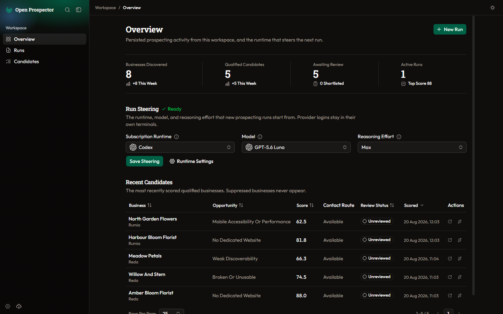
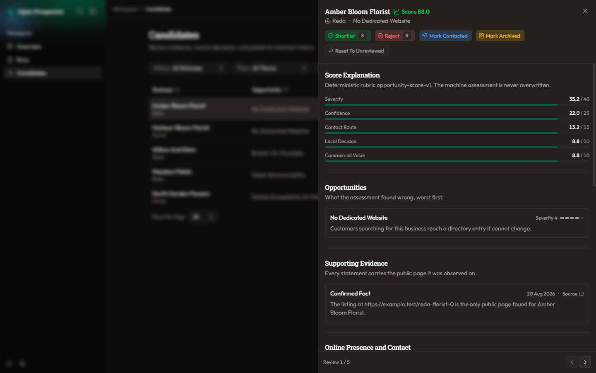

<p align="center">
  
</p>

<h1 align="center">Open Prospector</h1>

<p align="center">
  Open Prospector is a local app that finds independent businesses with evidence-backed website opportunities.
</p>

<p align="center">
  <strong>Use Claude, Codex, Or OpenCode Already Installed And Authenticated On Your Computer.</strong>
</p>

<p align="center">
  <a href="https://github.com/olewandowski1/open-local-prospector/actions/workflows/check.yml"></a>
  <a href="LICENSE"></a>
  
  
  
</p>



## What It Does

Open Prospector searches a place and business category, verifies each business, inspects its public
website, and ranks genuine opportunities. Every material claim keeps its source and observation
time.

Open Prospector runs the Claude, Codex, or OpenCode client already installed and authenticated on
your computer. It does not perform login, handle provider credentials, require usage-based API keys,
or add a metered fallback. It stores work locally in SQLite and sends no outreach. Choose any ready
runtime for each run.

## How A Run Works

1. **Define The Search:** Choose a location, business category, target, and authenticated runtime.
2. **Confirm Preflight:** Review the Search Area, local dependencies, and estimated workload.
3. **Run Local Research:** Open Prospector discovers, verifies, inspects, assesses, and scores businesses.
4. **Review Candidates:** Inspect source-backed evidence, then shortlist, reject, correct, suppress, or export.



## Core Principles

- Evidence comes before opinion.
- Application code owns search bounds, safety, scoring, retries, and persistence.
- Web content is untrusted data, never instruction.
- Runs are bounded, durable, and resumable.
- The product has no outreach, CRM, telemetry, or cloud account.

## Quick Start

Requirements: Node.js 22 or newer, pnpm 10 or newer, and a Claude, Codex, or OpenCode client already
installed and authenticated on your computer. Docker, a database server, and search API keys are not
required.

```powershell
pnpm install
pnpm run setup
pnpm run app
```

Open <http://127.0.0.1:4310>. Run commands from the repository root.

## Commands

| Command | Purpose |
|---|---|
| `pnpm run app` | Set up, build, and run the web process and worker |
| `pnpm dev` | Run the development server and watching worker |
| `pnpm check` | Run the repository verification gate |
| `pnpm test:e2e` | Run synthetic desktop and mobile browser flows |
| `pnpm test:e2e:workspace` | Run destructive workspace tests in isolation |
| `pnpm docs:screenshots` | Rebuild the dark README screenshots |

## Configuration

Configuration is optional and non-secret. Copy `.env.local.example` to `.env.local` to change
workspace paths, concurrency, geocoding, or runtime executables.

## Architecture And Documentation

Next.js serves the local interface, a separate worker executes durable jobs, and SQLite stores the
workspace. Start with the [Documentation Index](docs/README.md), [Product](docs/Product.md),
[Domain Language](docs/Domain-Language.md), [Architecture](docs/Architecture.md), and
[Changelog](CHANGELOG.md).

## Verification

```powershell
pnpm check
pnpm test:e2e
```

## Responsible Use

Open Prospector reads public pages and contacts nobody. You remain responsible for provider terms,
source terms, privacy law, and any outreach outside the application.

## License

[MIT](LICENSE)
